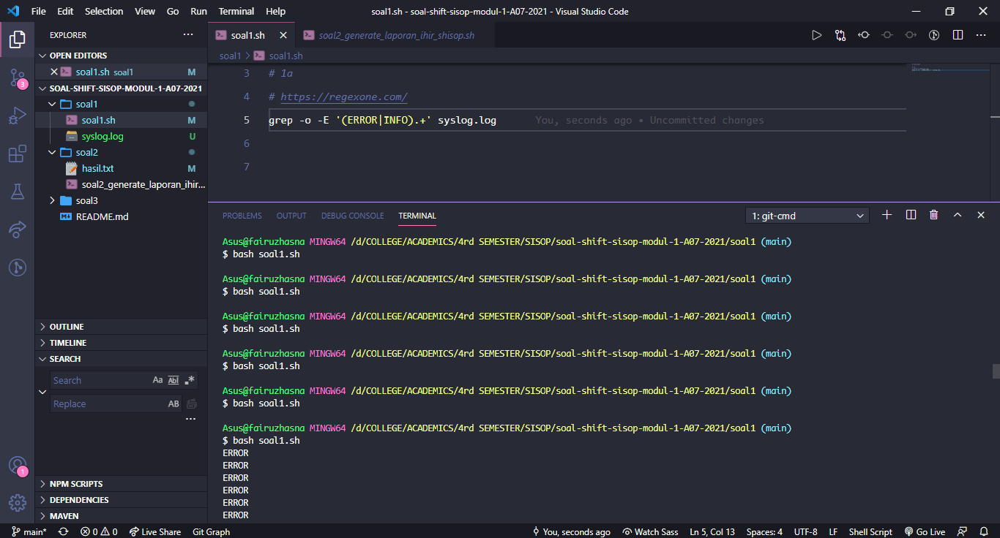

# soal-shift-sisop-modul-1-A07-2021

Soal Shift Modul 1

Kelompok A07

Sistem Operasi 2021

## 1. Pesan Error Ryujin
Mengolah data syslog.log, contoh data adalah sebagai berikut:

Jan 31 00:09:39 ubuntu.local ticky: INFO Created ticket [#4217] (mdouglas)  
Jan 31 00:16:25 ubuntu.local ticky: INFO Closed ticket [#1754] (noel)  
Jan 31 00:21:30 ubuntu.local ticky: ERROR The ticket was modified while updating (breee)  
Jan 31 00:44:34 ubuntu.local ticky: ERROR Permission denied while closing ticket (ac)(rr.robinson)  
....  
....  

### 1a) Menampilkan jenis log (ERROR/INFO), pesan log, dan username pada setiap baris lognya
````bash
grep -o -E '(ERROR|INFO).+' syslog.log
```` 
#### Cara Pengerjaan
memakai regex `'(ERROR|INFO).+'` untuk mengambil info dari data menjadi (contoh):
 - INFO Closed ticket [#1754] (noel)
 - ERROR The ticket was modified while updating (breee)
 
 pertama dicocokkan dengan grup `ERROR` atau `INFO`, kemudian `.` adalah bebas, dan `+` untuk repetisi 1 atau lebih karakter. Opsi `-o` untuk hanya keluarkan regex yang match, `-E` untuk grep dapat memakai regex.
#### Kendala
awalnya kebingungan mendapatkan ide untuk bagaimana mengekstrak data selain dengan AWK.
#### Screenshot

### 1b) Menampilkan semua pesan error yang muncul beserta jumlah kemunculannya

````bash
grep -o -E '(ERROR).+' syslog.log | grep -o -P '(?<=ERROR ).*(?= \()'  | sort | uniq -c
````
Output:
13 Connection to DB failed  
     10 Permission denied while closing ticket  
      9 The ticket was modified while updating  
      7 Ticket doesn't exist  
     15 Timeout while retrieving information  
     12 Tried to add information to closed ticket  
#### Cara Pengerjaan
Setelah command `grep -o -E '(ERROR).+' syslog.log` untuk mengekstrak data seperti no 1a, kemudian diekstrak lagi dengan regex `'(?<=ERROR ).*(?= \()'` untuk mengekstrak data di antara `ERROR` dan karakter `\`. Kemudian `sort` berdasar pesan error, kemudian `uniq` untuk menampilkan line yang unik dan `-c` untuk menghitung line yang duplikat.
#### Kendala
- Awalnya kebingungan cara mengekstrak data di antara pattern tertentu.
#### Screenshot

https://stackoverflow.com/questions/13242469/how-to-use-sed-grep-to-extract-text-between-two-words

### 1c) Menampilkan jumlah kemunculan log ERROR dan INFO untuk setiap user-nya
````bash
declare -A errorCount
declare -A infoCount
declare -A userArray

while read -r line ; do
    if [[ "${line}" =~ \(.+\) ]]; then # mencocokkan dengan yang diawali '(' dan diakhiri ')'
    line2=${BASH_REMATCH[0]}
        if [[ "${line2}" =~ ([a-z]|\.)+ ]]; then # di ekstrak lagi yang di dalam '()' , mencari [a-z] dan karakter '.'
        user=${BASH_REMATCH[0]}
        fi
    fi

    ((userArray[$user]++)) # membuat array asosiatif dengan key = username

    if [[ "${line}" =~ (ERROR|INFO) ]]; then
        logClass=${BASH_REMATCH[0]}
    fi
    
    if [[ $logClass == "ERROR" ]]; then # dicek log class nya untuk dihitung berapa error / infonya per user
        ((errorCount[$user]++))
    else ((infoCount[$user]++))
    fi

done < <(grep -o -E '(ERROR|INFO).+' syslog.log)

for i in "${!userArray[@]}" # print 
do
  printf "$i INFO %d ERROR %d\n" "${infoCount[$i]}" "${errorCount[$i]}"
done
````
Output:  
mai.hendrix INFO 0 ERROR 3  
montanap INFO 0 ERROR 4  
jackowens INFO 2 ERROR 4  
breee INFO 1 ERROR 5  
....  
....  
#### Cara Pengerjaan
````bash
while  read -r line ;  do
# KODE UNTUK MEMPROSES PER LINE
done  <  <(grep -o -E '(ERROR|INFO).+' syslog.log)
````
memakai kode tersebut untuk memproses per line hasil dari command `grep -o -E '(ERROR|INFO).+' syslog.log`, kemudian memakai `=~` untuk dicocokkan dengan regex. Penjelasan regex ada di comment code. Memakai BASH_REMATCH untuk mereturn line yang cocok dengan regex. Index 0 untuk 1 line penuh, index 1 untuk column pertama (contoh: "ERROR"/"INFO"), index 2 untuk column ke dua, dst. Hingga akhirnya variabel `line2` berisi username.

Kemudian penjelasan berikutnya ada di comment code.
#### Kendala
Awalnya kebingungan bagaimana mengekstrak data yang ingin di regex dan mengolah kemunculannya berdasar hasil ekstrakan (yaitu berdasar username). Ternyata kuncinya adalah `BASE_REMATCH`.
#### Screenshot

https://stackoverflow.com/questions/16317961/how-to-process-each-output-line-in-a-loop
https://linuxize.com/post/how-to-compare-strings-in-bash/
https://stackoverflow.com/questions/1898553/return-a-regex-match-in-a-bash-script-instead-of-replacing-it
### 1d) Semua informasi yang didapatkan pada poin b dituliskan ke dalam file error_message.csv dengan header Error,Count yang kemudian diikuti oleh daftar pesan error dan jumlah kemunculannya diurutkan berdasarkan jumlah kemunculan pesan error dari yang terbanyak
````bash
(printf "Error,Count\n"
grep -o -E '(ERROR).+' syslog.log | grep -o -P '(?<=ERROR ).*(?= \()' | sort | uniq -c | sort -nr | sed -e 's/^ *\([0-9]\+\) \(.\+\)/\2,\1/'
) > error_message.csv
````
#### Cara Pengerjaan
`grep -o -E '(ERROR).+' syslog.log | grep -o -P '(?<=ERROR ).*(?= \()' | sort | uniq -c` sama seperti no 1b, kemudian di `sort -nr` untuk diurut berdasarkan kemuncukan terbanyak, `n` untuk sort berdasar string secara numerikal (dari kecil ke besar), `r` untuk urut reverse (sehingga dari besar ke kecil). Kemudian memakai sed untuk memformat output. `\([0-9]\+\)` untuk mendapat angka (column 1), dan `\(.\+\)` untuk mendapat column 2 (karakter `.` untuk bebas), kemudian peletakannya diformat dengan `\2,\1` (column 2, koma, kemudian column 1).

Kemudian memakai `>` untuk menarut outputnya pada file error_message.csv.
#### Kendala

 - Kebingungan cara memformat, sebelum mengetahui dapat dilakukan dengan sed.
 - Error di pattern sed.
#### Screenshot

https://stackoverflow.com/questions/8948975/how-do-you-do-custom-formatting-with-the-uniq-c-option
https://unix.stackexchange.com/questions/170043/sort-and-count-number-of-occurrence-of-lines
### 1e) Semua informasi yang didapatkan pada poin c dituliskan ke dalam file user_statistic.csv dengan header Username,INFO,ERROR diurutkan berdasarkan username secara ascending.
#### Cara Pengerjaan
````bash
declare -A errorCount
declare -A infoCount
declare -A userArray

while read -r line ; do
    if [[ "${line}" =~ \(.+\) ]]; then
    line2=${BASH_REMATCH[0]}
        if [[ "${line2}" =~ ([a-z]|\.)+ ]]; then
        user=${BASH_REMATCH[0]}
        fi
    fi

    ((userArray[$user]++))

    if [[ "${line}" =~ (ERROR|INFO) ]]; then
        logClass=${BASH_REMATCH[0]}
    fi
    
    if [[ $logClass == "ERROR" ]]; then
        ((errorCount[$user]++))
    else ((infoCount[$user]++))
    fi

done < <(grep -o -E '(ERROR|INFO).+' syslog.log)

printf "Username,INFO,ERROR\n"
for i in "${!userArray[@]}"
do
  printf "$i,%d,%d \n" "${infoCount[$i]}" "${errorCount[$i]}"
done | sort

# command agar output ditaruh di file csv, test.sh adalah file shell script untuk soal 1e
bash test.sh | tee user_statistic.csv
````
#### Cara Pengerjaan
Program dari no 1c, ditambah `sort` agar terurut berdasar username (kebetulan username sudah di awal). Kemudian jalankan script dengan command `bash test.sh |  tee user_statistic.csv` pada bash. Maka hasil output akan tertulis pada user_statistic.csv .
#### Kendala

 - Awalnya tidak ada output apa-apa, command salah.
 #### Screenshot

https://stackoverflow.com/questions/8217049/bash-associative-array-sorting-by-value

## 2. Laporan Toko ShiSop
> Source Code 
 > **[soal2_generate_laporan_ihir_shisop.sh](https://github.com/hasnarof/soal-shift-sisop-modul-1-A07-2021/blob/main/soal2/soal2_generate_laporan_ihir_shisop.sh)**

> Hasil Laporan 
 > **[hasil.txt](https://github.com/hasnarof/soal-shift-sisop-modul-1-A07-2021/blob/main/soal2/hasil.txt)**
 
Dataset yang digunakan pada soal nomor 2 ini merupakan dataset penjualan TokoShiSop yang terdiri dari 21 kolom dan 9995 baris. Dataset ini berformat .tsv,  oleh karena itu untuk pengolahan data pada soal nomor 2 dapat diselesaikan dengan menggunakan program AWK dengan field separator karakter tab ('\t').

### a. Mencari ID transaksi terakhir yang memiliki profit percentage terbesar 

Profit percentage merupakan hasil pembagian dari kolom Price dengan kolom hasil pengurangan kolom Sales dan Profit.

Untuk mencari row dengan profit percentage terbesar dan transaksi yang terakhir dilakukan proses:
1. ````-v max=0```` berfungsi untuk membuar variabel maru max yang digunakan sebagai variabel pembantu untuk mengecek setiap row untuk mendapatkan nilai maksimum.

2. ````NR>1```` digunakan agar proses program melewati/mengabaikan isi baris pertama yaitu nama kolom

3. Dilakukan pemfilteran kondisi untuk mendapatkan nilai maksimum profit percentage, jika nilai profit percentage di row tersebut lebih besar atau sama dengan nilai max saat ini, maka akan disimpan nilai row_id nya pada variabel ````id```` dan nilai variabel ````max```` akan diupdate dengan profit percentage row tersebut.

4. Setelah proses selesai, maka akan keluar output berupa id transaksi serta berapa profit percentage maksimumnya.


```bash
awk -F"\t" -v max=0 'NR>1{    
    if($21/($18-$21)*100>=max){
        id=$1; max=$21/($18-$21)*100
        }
    }
END{
    printf "Transaksi terakhir dengan profit percentage terbesar
            yaitu %d dengan persentase %.2f%.\n\n", id, max
    }' Laporan-TokoShiSop.tsv
````

Berikut output dari script tersebut:
.png)

### b. Mencari nama kustomer yang berada di Alburquerque pada tahun 2017

Untuk menyelesaikan problem ini, digunakan metode pipe di AWK  

1. Script pertama AWK digunakan untuk memfilter baris pada dataset yang memiliki nilai kolom City sama dengan Albuquerque dengan menggunakan conditional statement ````if($10 ~ /Albuquerque/)````. Jika memenuhi kondisi tersebut maka akan memunculkan output $7,$3 yaitu Customer dan Tanggal Transaksi. Setelah itu output akan di-print kemudian drop nama Customer yang duplikat dengan pipe dan command ```` | uniq ````.

2. Setelah itu akan di-pipe lagi dengan command baru yang bertujuan untuk mencari hasil ouput awk sebelumnya yang tanggal transaksinya tahun 2017.

3. Untuk memfilter tahun, maka kita perlu mengekstrak tahun dari kolom tanggal atau kolom $3 dari hasil output AWK yang pertama, tanggal transaksi berformat dd-mm-yy atau field separator berupa "-". Oleh karena itu, output di-split dan disimpan pada array `tgl`. Baru dilakukan conditional statement ````if(tgl[3] ~ /17/)````, jika memenuhi kondisi tersebut maka print $1 dan $2 yang merupakan nama Customer yang di Albuquerque pada tahun 2017.

```bash
echo "Daftar nama customer di Albuquerque pada tahun 2017 antara lain :"
awk -F'\t' 'NR>1{ 
    if($10 ~ /Albuquerque/) print $7,$3
    }' Laporan-TokoShiSop.tsv | uniq |
    awk '{split($0,tgl,"-"); if(tgl[3] ~ /17/) print $1,$2}'

printf "\n"
```

Berikut output dari script tersebut:
.png)

### c. Tipe segmen customer yang penjualannya paling sedikit dan total transaksinya.

Hampir sama seperti soal sebelumnya, untuk menyelesaikan soal ini menggunakan pipe AWK

1. ````segmen[$8]++```` digunakan untuk menghitung banyak transaksi dengan kolom segmen customer sebagai key.
2. Kemudian looping ```for (s in segmen)``` untuk mengiterasi array segmen di setiap key (```s```), kemudian print key (```s```) serta value-nya (```segmen[s]```).
3. ```sort -g -k 2``` untuk mengurutkan output berdasarkan kolom kedua (banyak transaksi) secara ascending.
4. `head -n 1` untuk menampilkan head-nya saja atau urutan yang paling kecil.
5. Kemudian print sesuai format, dengan split hasil output sebelumnya dengan field separator spasi ' ' menjadi array ```segmen```, ```segmen[1]``` dan ```segmen[2]``` adalah nama segmen yang memiliki transaksi paling sedikit, serta ```segmen[3]``` adalah total transaksinya.

```bash
awk -F'\t' 'NR>1{
    segmen[$8]++
    }
END{ 
    for (s in segmen) print s, segmen[s]
    }' Laporan-TokoShiSop.tsv | sort -g -k 2 | head -n 1 | 
    awk '{split($0,segmen," "); 
    printf "Tipe segmen customer yang penjualannya paling 
            sedikit adalah %s %s dengan %d transaksi.\n\n", 
            segmen[1],segmen[2],segmen[3]}'
```
Berikut output dari script tersebut:
.png)

### d. Mencari region yang memiliki profit yang paling sedikit

Konsep soalnya hampir mirip dengan 2.c, bedanya di sini perlu menjumlahkan suatu kolom yaitu kolom profit untuk setiap region.

1. ````region[$13]+=$21```` digunakan untuk mendapatkan total profit dengan kolom region sebagai key.
2. Kemudian looping ```for (r in region)``` untuk mengiterasi array region di setiap key (```r```), kemudian print key (```r```) serta value-nya (```region[r]```).
3. ```sort -g -k 2``` untuk mengurutkan output berdasarkan kolom kedua (jumlah atau total profit) secara ascending.
4. ``` head -n 1``` untuk menampilkan head-nya saja atau urutan yang paling kecil.
5. Kemudian print sesuai format, dengan split hasil output sebelumnya dengan field separator spasi ' ' menjadi array ```region```, ```region[1]``` adalah nama region yang memiliki jumlah profit paling sedikit, serta ```region[2]``` adalah total profitnya.

```bash
awk -F'\t' 'NR>1{
    region[$13]+=$21
    }
END{
    for (r in region) print r,region[r]
    }' Laporan-TokoShiSop.tsv | sort -g -k 2 | head -n 1 |
    awk '{split($0,region," "); 
         printf "Wilayah bagian (region) yang memiliki 
         total keuntungan (profit) yang paling sedikit adalah %s 
         dengan total keuntungan %.2f.\n", region[1],region[2]}'
```
Berikut output dari script tersebut:
.png)

### e. Generate hasil.txt

Untuk meng-generate output dalam format file hasil.txt maka semua script tadi digabung dan ditambahkan ```> hasil.txt``` di akhir script.

Berikut merupakan hasil laporan yang sudah di-generate dalam format .txt
.png)

### Kendala
- Saat pertama kali membuat program AWK, baris pertama yang berisi nama-nama kolom pada data masih diikutkan, setelah itu saya mencari solusi untuk mengatasinya yaitu dengan menambahkan `NR>1` di awal script.
- Pada saat mengerjakan nomor 2b, program tidak bisa memfilter kondisi tahun 2017 dengan conditional statement seperti ini `if(tgl[3] == '17')` , akhirnya saya mengubahnya menjadi `if(tgl[3] ~ /17/)` dan program berhasil.

### Referensi
- https://stackoverflow.com/questions/39723726/how-to-skip-1st-line-of-file-awk
- https://stackoverflow.com/questions/14916826/awk-unix-group-by
- https://unix.stackexchange.com/questions/167280/awk-group-by-and-sum-column-values
- https://stackoverflow.com/questions/17048188/how-to-use-awk-sort-by-column-3

## 3. Soal No 3
Kuuhaku adalah orang yang sangat suka mengoleksi foto-foto digital, namun Kuuhaku juga merupakan seorang yang pemalas sehingga ia tidak ingin repot-repot mencari foto, selain itu ia juga seorang pemalu, sehingga ia tidak ingin ada orang yang melihat koleksinya tersebut, sayangnya ia memiliki teman bernama Steven yang memiliki rasa kepo yang luar biasa. Kuuhaku pun memiliki ide agar Steven tidak bisa melihat koleksinya, serta untuk mempermudah hidupnya, yaitu dengan meminta bantuan kalian. Idenya adalah :

### a.  Membuat script untuk mengunduh 23 gambar dari "https://loremflickr.com/320/240/kitten" serta menyimpan log-nya ke file "Foto.log". Karena gambar yang diunduh acak, ada kemungkinan gambar yang sama terunduh lebih dari sekali, oleh karena itu kalian harus menghapus gambar yang sama (tidak perlu mengunduh gambar lagi untuk menggantinya). Kemudian menyimpan gambar-gambar tersebut dengan nama "Koleksi_XX" dengan nomor yang berurutan tanpa ada nomor yang hilang (contoh : Koleksi_01, Koleksi_02, ...)
```#!/bin/bash
for ((q=1; q<=23; q++))
do
        for ((b=0; b<q; b=b+1))
        do
                if ((q<10))
                then
                wget -O "Koleksi_0$q.jpg" https://loremflickr.com/320/240/kitten -a "Foto.log"
                sama=$(cmp "Koleksi_0$q.jpg" "Koleksi_0$b.jpg")
                akun=$?
                #remove jika sama
                if [ $akun == 0 ]
                then
                        rm "Koleksi_0$q.jpg"
                        let q=$q-1
                        
                fi
                else
                wget -O "Koleksi_$q.jpg" https://loremflickr.com/320/240/kitten -a "Foto.log"
                        if ((b<10))
                        then
                                sama=$(cmp "Koleksi_$q.jpg" "Koleksi_0$b.jpg"  )
                                akun=$?
                                #remove jika sama
                                if [ $akun == 0 ]
                                then
                                rm "Koleksi_$q.jpg"
                                let q=$q-1 
                                fi
                        else 
                                sama=$(cmp "Koleksi_$q.jpg" "Koleksi_$b.jpg"  )
                                akun=$?
                                #remove jika sama
                                if [ $akun == 0 ]
                                then
                                rm "Koleksi_$q.jpg" 
                                let q=$q-1
                                fi
                        fi
                fi
        done
done
```
Cara Penyelesaian : Menggunakan metode looping ```for```  agar dapat mendownload 23 gambar. Gambar diunduh dengan perintah wget dengan nama filesnya Koleksi_* dan foto.log. Untuk mendownload gambar dengan file Koleksi_1 sampai Koleksi_9, diberi perintah if dan menggunakan perintah wget -O dengan dengan nama file Koleksi_0*. Kemudian, file  di bandingkan satu persatu apabila sama return 0, dan remove salah satu files sampai gambar ke 23.
### b. Karena Kuuhaku malas untuk menjalankan script tersebut secara manual, ia juga meminta kalian untuk menjalankan script tersebut sehari sekali pada jam 8 malam untuk tanggal-tanggal tertentu setiap bulan, yaitu dari tanggal 1 tujuh hari sekali (1,8,...), serta dari tanggal 2 empat hari sekali(2,6,...). Supaya lebih rapi, gambar yang telah diunduh beserta log-nya, dipindahkan ke folder dengan nama tanggal unduhnya dengan format "DD-MM-YYYY" (contoh : "13-03-2023").
### bash
```
#!/bin/bash
bash ./soal3a.sh 

file=$(date +%d-%m-%Y)
mkdir "$file"

mv ./Koleksi_* "./$file/"
mv ./Foto.log "./$file/"
echo "Alhamdulillah"
```
Cara Penyelesaian : Pertama, menjalankan soal3a.sh, kemudian membuat file dengan format tanggal sekarang. Membuat filenya dengan format ```mkdir {nama file}```. Kemudian, pindah hasil download dan foto.lognya dari soal3a.sh ke dalam folder yang telah dibuat.
### Cron
```0 20 1-31/7,2-31/4 * * bash ./soal3b.sh
```
Penjelasan: Menjalankan script pada jam 8:00 malam yaitu dengan commandnya ```0 20```, kemudian ketentuan tanggal 1 tujuh hari sekali (1,8,...), serta dari tanggal 2 empat hari sekali(2,6,...) yaitu ```1-31/7,2-31/4```, tanda bagi menunjukkan berapa hari sekali cron akan dijalankan dan tanda koma untuk menjalankan cron di waktu yang berbeda.

### c. Agar kuuhaku tidak bosan dengan gambar anak kucing, ia juga memintamu untuk mengunduh gambar kelinci dari "https://loremflickr.com/320/240/bunny". Kuuhaku memintamu mengunduh gambar kucing dan kelinci secara bergantian (yang pertama bebas. contoh : tanggal 30 kucing > tanggal 31 kelinci > tanggal 1 kucing > ... ). Untuk membedakan folder yang berisi gambar kucing dan gambar kelinci, nama folder diberi awalan "Kucing_" atau "Kelinci_" (contoh : "Kucing_13-03-2023").
```#!/bin/bash
hari=$(date +"%d-%m-%Y")
kucing=$(ls | grep -e "Kucing.*" | wc -l)
kelinci=$(ls | grep -e "Kelinci.*" | wc -l)
if [[ $kucing == $kelinci ]]
then
mkdir "Kelinci_$hari"
for ((q=1; q<=23; q++))
do
        for ((b=0; b<q; b=b+1))
        do
                if ((q<10))
                then
                wget -O "Koleksi_0$q.jpg" https://loremflickr.com/320/240/bunny -a "Foto.log"
                sama=$(cmp "Koleksi_0$q.jpg" "Koleksi_0$b.jpg")
                akun=$?
                #remove jika sama
                if [ $akun == 0 ]
                then
                        rm "Koleksi_0$q.jpg"
                        let q=$q-1

                fi
                else
                wget -O "Koleksi_$q.jpg" https://loremflickr.com/320/240/bunny -a "Foto.log"
                        if ((b<10))
                        then
                        sama=$(cmp "Koleksi_$q.jpg" "Koleksi_0$b.jpg"  )
                        akun=$?
                        #remove jika sama
                        if [ $akun == 0 ]
                        then
                        rm "Koleksi_$q.jpg"
                        let q=$q-1 
                        fi
                        else 
                        sama=$(cmp "Koleksi_$q.jpg" "Koleksi_$b.jpg"  )
                        akun=$?
                        #remove jika sama
                        if [ $akun == 0 ]
                        then
                        rm "Koleksi_$q.jpg" 
                        let q=$q-1
                        fi
                fi
                fi
        done
done
mv ./Koleksi_* ./Foto.log "./Kelinci_$hari"
else 
mkdir "Kucing_$hari"
for ((q=1; q<=23; q++))
do
        for ((b=0; b<q; b=b+1))
        do
                if ((q<10))
                then
                wget -O "Koleksi_0$q.jpg" https://loremflickr.com/320/240/kitten -a "Foto.log"
                sama=$(cmp "Koleksi_0$q.jpg" "Koleksi_0$b.jpg")
                akun=$?
                #remove jika sama
                if [ $akun == 0 ]
                then
                        rm "Koleksi_0$q.jpg"
                        let q=$q-1

                fi
                else
                wget -O "Koleksi_$q.jpg" https://loremflickr.com/320/240/kitten -a "Foto.log"
                        if ((b<10))
                        then
                        sama=$(cmp "Koleksi_$q.jpg" "Koleksi_0$b.jpg"  )
                        akun=$?
                        #remove jika sama
                        if [ $akun == 0 ]
                        then
                        rm "Koleksi_$q.jpg"
                        let q=$q-1 
                        fi
                        else 
                        sama=$(cmp "Koleksi_$q.jpg" "Koleksi_$b.jpg"  )
                        akun=$?
                        #remove jika sama
                        if [ $akun == 0 ]
                        then
                        rm "Koleksi_$q.jpg" 
                        let q=$q-1
                        fi
                fi
                fi
        done
done
mv ./Koleksi_* ./Foto.log "./Kucing_$hari"
fi
```
Penjelasan: Pertama, untuk mendownload secara bergantian menggunakan grep dan wc, dimana grep ini akan mencari untuk mencari kata atau kalimat dalam file yaitu kucing dan kelinci, dan Wc -l Menghitung jumlah line atau barisnya dalam suatu file. Untuk kondisi awal karena jumlah folder kelinci sama dengan folder kucing dan jumlahnya nol. Maka, kita dapat mendownload bebas file mana dulu, disini kita akan mendownload file kelinci terlebih dahulu, untuk cara mendownloadnya sama dengan soal 3a, kemudian hasil downloadnya dan foto lognya akan dimasukan kedalam file yang berformat Kelinci_tanggaldownload. Setelah hari berikutnya, karena kondisi jumlah file kelinci lebih besar dari jumlah kucing maka akan mendownload file kucing, kemudian hasil download dan foto lognya dimasukkan ke dalam folder dengan format Kucing_tanggaldownload. 
### d. Untuk mengamankan koleksi Foto dari Steven, Kuuhaku memintamu untuk membuat script yang akan memindahkan seluruh folder ke zip yang diberi nama “Koleksi.zip” dan mengunci zip tersebut dengan password berupa tanggal saat ini dengan format "MMDDYYYY" (contoh : “03032003”).
```#!/bin/bash

namafiles=$(date +"%d%m%Y")

zip -P "$namafiles" -r -m Koleksi.zip ./Kucing_* ./Kelinci_*
```
Penjelasan : Pertama, kita membuat passwordnya terlebih berupa tanggal saat ini yaitu ```namafiles=$(date +"%d%m%Y")```. Untuk proses zip dengan password menggunakan command zip -P, maka akan terproses file zip "Koleksi.zip" dengan password yang sudah diset pada tanggal saat ini.
### e. Karena kuuhaku hanya bertemu Steven pada saat kuliah saja, yaitu setiap hari kecuali sabtu dan minggu, dari jam 7 pagi sampai 6 sore, ia memintamu untuk membuat koleksinya ter-zip saat kuliah saja, selain dari waktu yang disebutkan, ia ingin koleksinya ter-unzip dan tidak ada file zip sama sekali.
```0 7 * * 1-5 bash ./soal3d.sh

0 18 * * 1-5 unzip -P $(date +"%d%m%Y") Koleksi.zip && rm Koleksi.zip
```
Penjelasan : Pada baris pertama setiap pukul 7:00 pagi, command cronnya adalah ```0 7```, untuk hari senin sampai hari jum'at commandnya adalah ```1-5```, '1' menandakan hari senin sampai '5' menandakan hari kelima yaitu jum'at. Kemudian, kita diminta untuk mengzip, kita ambil saya script dan jalankan script soal3d. Pada baris ketiga, diminta pada pukul 6 sore, maka command di cronya ```0 18```, untuk hari senin sampai hari jum'at commandnya adalah ```1-5```, '1' menandakan hari senin sampai '5' menandakan hari kelima yaitu jum'at.  Kemudian, kita diminta untuk unzip filenya, solusinya sama dengan soal 3d yaitu unzip -P artinya unzip dengan mengset passwordnya tanggal saat ini, kemudian kita dapat meremove file Koleksi.zip dengan command 'rm'  

### Soal 3c sebelum revisi
```#!/bin/bash
hari=$(date +"%d-%m-%Y")
mkdir "Kelinci_$hari"
mkdir "Kucing_$hari"


for ((q=1; q<=23; q++))
do
    if((q % 2 == 0))
    then
    for((b=0; b<q; b=b+2))
    do
        wget -O "Koleksi_$q.jpg" https://loremflickr.com/320/240/kitten -a "Foto.log"
        mv ./Koleksi_* "./Kucing_$hari"
        sama=$(cmp "Koleksi_$q.jpg" "Koleksi_$b.jpg")
        akun=$?
        #remove jika sama
        if [ $akun == 0 ]
        then
                rm "Koleksi_$q.jpg"
                let q=$q-1
        fi
    done
    
    else
    for((b=1; b<q; b=b+2))
    do
        wget -O "Koleksi_$q.jpg" https://loremflickr.com/320/240/bunny -a "Foto.log"
        mv ./Koleksi_* "./Kelinci_$hari"
        sama=$(cmp "Koleksi_$q.jpg" "Koleksi_$b.jpg")
        akun=$?
        #remove jika sama
        if [ $akun == 0 ]
        then
                rm "Koleksi_$q.jpg"
                let q=$q-1
        fi
    done
    
    fi
done
```
Disini kami, mengira bahwasannya yang bergantian adalah file yang akan downloadnya, sehingga pada downloadnya kita buat modulus dan membandingkannya. Kemudian files hasil download berupa kelipatan Kucing_01,Kucing_03, Kucing_05. Untuk kelinci juga demikian yaitu dengan format genap, Kelinci_02, Kelinci_04, dst. Kemudian kedua hasil download dan foto lognya dimasukkan ke dalam masing-masing file dengan format File_tanggaldownload, ex Kelinci_04-04-2021 dan Kucing_04-04-2021 
